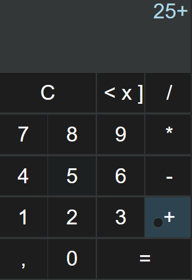

<div>
<h1 align="center">Calculator 
 
</h1>

<h3 align="center">Tabela de conteúdos</h3>

 <p align="center">
 <a href="#objetivo">Objetivo</a> •
 <a href="#desc">Descrição do Projeto</a> • 
 <a href="#features">Features</a> •  
 <a href="#demonstracao">Demonstração</a> •
 <a href="#tecnologias">Tecnologias</a> • 
 <a href="#requisitos">Pré requisitos</a> • 
 <a href="#init">Iniciando a aplicação</a> • 
 <a href="#autor">Autor</a>
</p>
  
---

<br/>

<a id="objetivo"></a>

### 💡 Objetivo

<br/>
<p>Esse projeto foi desenvolvido com a finalidade de adiquirir experiencia, e desevolver habilidades na programação Front-end.</p><br/>

<a id="desc"></a>

### 📝 Descrição do projeto

<br/>
<p> 
  Calculadora JS é um projeto com o layout baseado na calculadora do windows, que aborda em CSS responsividade, display Grid e display Flex. Em JavaScript é abordado a utilização da DOM, arrow functions e manipulação array, regex para validar entrada de valores.
</p><br/>

<a id="features"></a></br>

### ⚙ Features

</br>

- [x] Validação de entrada de valores;
- [x] Função que executa as operações;
- [ ] Função para o botão backspace;
- [ ] Função clear, para o input ficar com o valor default;

</br>

<a id="demonstracao"></a>

### 🎬 Demonstração da aplicação

<br/>
<div align="center">
 
 </div>

<a id="tecnologias"></a><br/>

### 🛠 Tecnologias

<br/>
<div align="center">


</div>
<a id="requisitos"></a><br/>

### 📎 Pré requisitos

<br/>

- Git
- Navegador

<a id="init"></a><br/>

### 🎮 Iniciando a aplicação

<br/>

```
Abrir o arquivo index.html no navegador
```

<a id="autor"></a><br/>

### 🙋‍♂️ Autor

<p align="center">Mikael Magalhães</p>

<div align="center">

[][linkedin]
<a href="mailto:mikael.omagalhaes@gmail.com">

</a>
[][instagram]
</div>
[linkedin]:https://www.linkedin.com/in/mikael-magalhães
[instagram]:https://www.instagram.com/mikael_henrique__/

