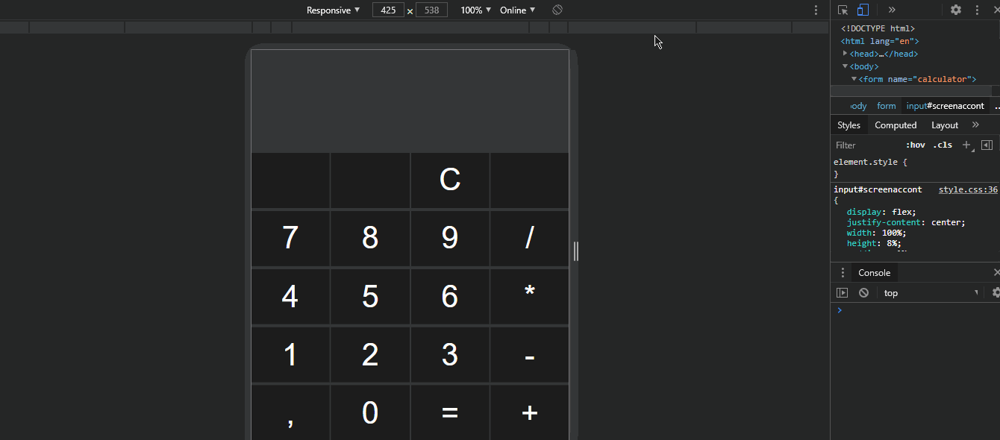

**<h1 align="center" style = "color : yellow ;"> Calculator Js</h1>**

 

<h1 align="center">
  
</h1>

 

### **Sobre** 📝

Projeto pessoal, que busca explorar conceito de responsividade com css grid e display flex, juntamente com a lingugem JavaScript para estar realizando algumas operações.

---

 

### **Tecnologias usadas** 📐🚀

- Html 5
- CSS 3
- JavaScript
